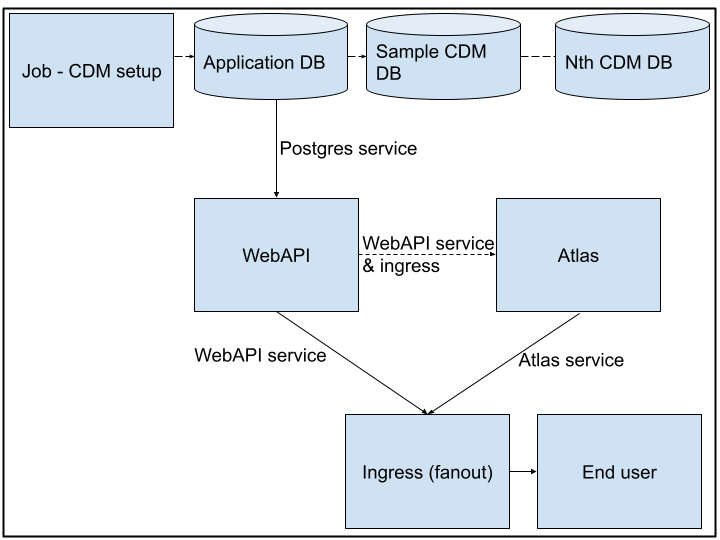

# Atlas Deployment on Kubernetes

The document outlines the architecture and the deployment instructions for OHDSIs tool called ATLAS along with a sample CDM database. This implementation builds on existing containers of various components including [ATLAS](https://hub.docker.com/r/ohdsi/atlas), [WebAPI](https://hub.docker.com/r/ohdsi/webapi), [Postgres db](https://hub.docker.com/_/postgres) and [a sample Broadsea CDM](https://hub.docker.com/r/ohdsi/broadsea-atlasdb). 

# Architecture

The architecture is derived from the [Atlas architecture](https://github.com/OHDSI/WebAPI/wiki) with some terminologies relevant to Kubernetes. Figure 1 shows the  architecture diagram and it serves as reference for K8s implementation.

Figure 1: ATLAS Architecture

# 

# Kubernetes cluster dimensioning

To deploy this implementation a kubernetes cluster is needed. The suggested dimensions of the cluster are that it contains a minimum 2 medium sized worker nodes (e.g. 2x 4 VCPUs and 8G RAM) and a minimum of 5GB persistent storage volume for application database. While the CDM database requirements are not outlined here. Additionally, if deployed in a cloud environment a load balancer and an ingress with domain name is recommended with Https setup. 

# Sequence of deployment

This deployment is a collection of yaml files which translates the deployment instructions into infrastructure as code yaml files. The relevant Atlas files are in the working-blocks directory on the [Github repository](https://github.com/Aleem2/Atlas-OHDSI-ARDC/tree/clean-up). The instructions are meant to be followed sequentially. 

* Create a namespace using the following command.  
  * kubectl create \-f ns-ohdsi.yaml  
* Edit / verify passwords for various atlas services. Next create kubernetes secrets. All secrets are managed through this file. Recommend keeping this file at a safe place.   
  * kubectl create \-f atlas-secrets.yaml  
* **Deploy Postgres application db**  
  * kubectl create \-f postgres-pvc.yaml  
  * kubectl create \-f postgres-init-script-configmap.yaml  
  * kubectl create \-f postgres-deployment.yaml  
  * kubectl create \-f postgres-service.yaml  
* **Deploy WebAPI with relevant configurations**  
  * kubectl create \-f webapi-deployment.yaml  
  * kubectl create \-f webapi-service.yaml  
* **Ingress for the application access over internet**  
* This is an important step because it allows traffic to both ATLAS and WebAPI. A test setup is outlined below. While for practical implementation consider using a domain name with HTTPS setup. Nectar tutorials has an excellent example of this [https://tutorials.rc.nectar.org.au/kubernetes/06-ingress](https://tutorials.rc.nectar.org.au/kubernetes/06-ingress). A simple test setup is outlined below.   
  * For the test setup, load balancer IP is being used along with nip.io for traffic fan out.   
  * kubectl create \-f atlas-ingress.yaml  
  * Execute the following command to get the ip address of the ingress, we will call it the ingress ip. Ingress might take a while to get created and assign an IP address, so execute the command repeatedly.   
    * kubectl get ingress  
  * Updating the Atlas configuration file  
    * Use the ingress ip from previous step and update the “atlas-configmap.yaml”  
      * The given yaml has 203.101.238.240.nip.io. So change the ip address preceding  “.nip.io”.   
      * kubectl create \-f atlas-configmap.yaml  
  * kubectl create \-f atlas-deployment-v0.3.yaml  
  * kubectl create \-f atlas-service.yaml

* **Setup Sample CDM (Broadsea sample db) and the required configurations for WebAPI**  
  * The setup of a CDM is delayed to last as WebAPI manipulates the db by creating some tables. These tables are populated with sample CDM settings by applying following scripts.   
  * kubectl create \-f broadsea-db-deploy.yaml  
  * kubectl create \-f broadsea-db-service.yaml  
  * kubectl create \-f cdm-setup-script-cm.yaml  
    * If you want to add another CDM edit cdm-setup-script-cm.yaml with relevant details. Followed by delete and create the job below.  
  * kubectl create \-f broadsea-db-setup-job.yaml

